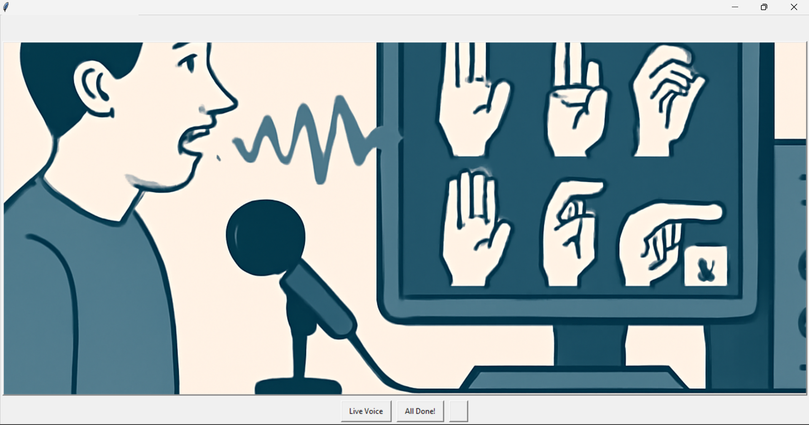
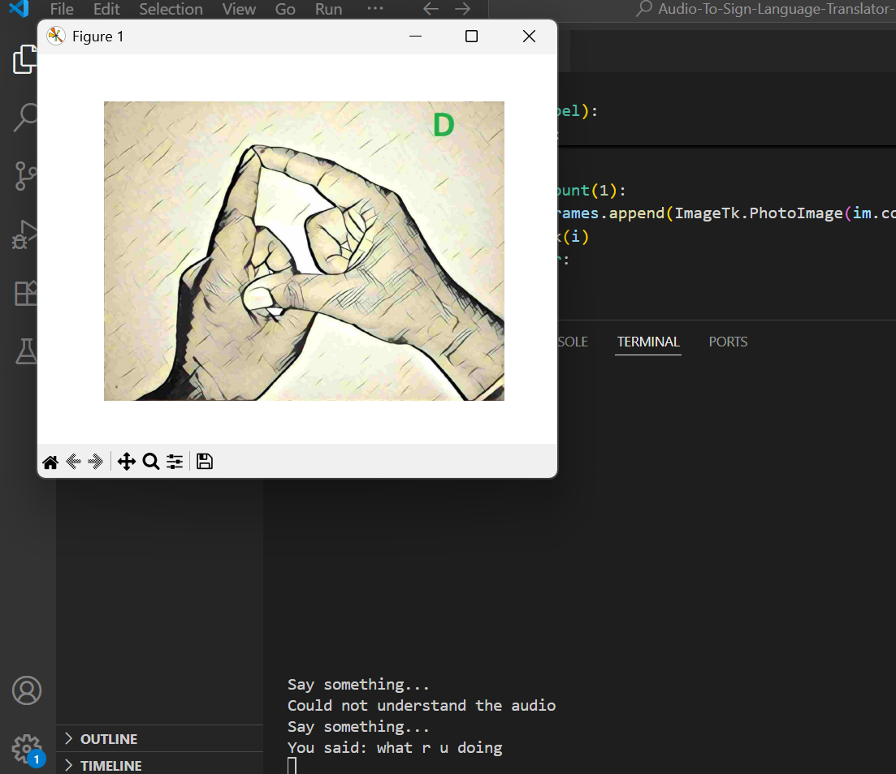

# 🎙️ Audio-to-Sign-Language Translator  

This project is a **Hearing Impairment Assistant** that converts **spoken words (speech)** into **Indian Sign Language (ISL) animations or letter images**.  
It helps bridge communication gaps by enabling hearing-impaired individuals to understand spoken English phrases in real time.  

---

## 📌 Features  

- 🎤 **Speech Recognition** using Google Speech Recognition API (`speech_recognition`).  
- 🖼️ **Sign Language Translation**:  
  - Predefined phrases are mapped to animated **ISL GIFs**.  
  - Non-predefined words are broken down into **individual alphabets** and shown as images.  
- 📂 **Predefined dataset** of ISL GIFs (common phrases like "good morning", "take care", etc.).  
- 🖥️ **Graphical Interface** using **EasyGUI** and **Tkinter**.  
- 📊 **Letter visualization** using **Matplotlib** for alphabets.  
- ✅ Option to **exit** by saying "goodbye".  

---

## 🛠️ Tech Stack  

- **Python 3.x**  
- **Libraries Used**:  
  - `speech_recognition` – Speech to text conversion  
  - `numpy` – Array operations  
  - `matplotlib` – Image display  
  - `easygui` – Simple GUI buttons  
  - `tkinter` – GIF animations  
  - `PIL (Pillow)` – Image processing  

---

## 📂 Project Structure  

```
Audio-To-Sign-Language-Translator/
│── ISL_Gifs/              # Folder containing GIFs for predefined phrases
│── letters/               # Folder containing images for each alphabet (a.jpg, b.jpg, etc.)
│── signlang.png           # Project logo / front image
│── signlang_resized.png   # Resized logo for GUI
│── main.py                # Main Python script (your provided code)
│── selecting.py           # (Optional) Additional feature script
│── README.md              # Project documentation
```

---

## 🚀 How to Run  

### 1️⃣ Clone the repository  
```bash
git clone https://github.com/your-username/Audio-To-Sign-Language-Translator.git
cd Audio-To-Sign-Language-Translator
```

### 2️⃣ Install dependencies  
```bash
pip install speechrecognition numpy matplotlib easygui pillow
```

> ⚠️ On some systems, you may need to install `pyaudio` separately:  
```bash
pip install pipwin
pipwin install pyaudio
```

### 3️⃣ Run the project  
```bash
python main.py
```

---

## 🎯 Usage  

1. Launch the program.  
2. Choose **Live Voice** from the GUI.  
3. Speak into the microphone.  
   - If the phrase exists in the ISL dataset → corresponding **GIF** will be shown.  
   - If the phrase is not found → it will show **alphabet signs** for each letter.  
4. Say **"goodbye"** to exit.  

---

## 🖼️ Example  

- Saying: **"good morning"** → Displays **Good Morning ISL GIF**.  
- Saying: **"hello"** → Displays ISL signs for **H → E → L → L → O**.  

---

## 📸 Screenshots & Demos  

Here are some sample previews of the project in action:  

| Feature | Screenshot |
|---------|------------|
| **Main Menu** |  |
| **Phrase to GIF** |  |
| **Alphabet Translation** |  |


---

## 📌 Future Improvements  

- Add support for **more phrases and GIFs**.  
- Enable **bidirectional translation** (Sign Language → Speech).  
- Build an **offline speech recognition model** to avoid internet dependency.  

---


